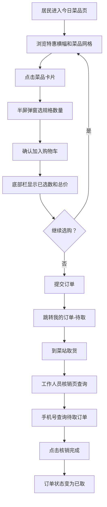

## 1. 产品概述

小区菜站预订系统，面向社区居民提供当日蔬菜线上预订、到站自取的便捷服务。解决居民下班后菜品售罄、排队久的问题，同时支持菜站工作人员高效核销订单。

## 2. 核心功能

### 2.1 用户角色

| 角色 | 说明 | 核心权限 |
|------|------|----------|
| 居民 | 社区住户 | 浏览菜品、下单预订、查看订单 |
| 菜站工作人员 | 菜站值班人员 | 查询待取订单、核销订单 |

### 2.2 功能模块

1. **今日菜品页**：特惠横幅、菜品卡片网格、规格数量选择、购物底栏
2. **我的订单页**：待取/历史订单切换、菜品列表折叠展开、订单状态展示
3. **核销页**：手机号查询待取订单、一键核销

### 2.3 页面详情

| 页面名称 | 模块名称 | 功能描述 |
|----------|----------|----------|
| 今日菜品 | 特惠横幅 | 顶部展示当日特价菜品轮播，点击可快速定位 |
| 今日菜品 | 菜品卡片网格 | 双列网格，每卡含菜品图片、名称、规格、会员价；库存<5斤标橙"即将售罄" |
| 今日菜品 | 半屏选择弹窗 | 点击卡片弹出半屏弹窗，选规格、数量，确认加入购物车 |
| 今日菜品 | 底部固定栏 | 显示已选数量和总价，点击可展开购物车详情或跳转订单 |
| 我的订单 | 待取订单列表 | 展示待取货订单，含取货时间、菜品列表（可折叠）、状态标签 |
| 我的订单 | 历史订单列表 | 展示已完成/已取消的历史订单 |
| 核销页 | 手机号查询 | 输入手机号查询今日待取订单 |
| 核销页 | 核销操作 | 点击"核销"按钮完成取货确认 |

## 3. 核心流程

## 4. 用户界面设计

### 4.1 设计风格

- 主色：深绿 #2D6A4F，辅色：浅绿 #52B788、米白 #FAF8F5
- 强调色：橙色 #F77F00（售罄提醒）
- 按钮风格：圆角8px，主按钮实心深绿，次按钮描边浅绿
- 字体：思源黑体（Noto Sans SC），标题16px粗体，正文14px常规，辅助12px
- 布局：移动端优先，375px起步，卡片双列网格
- 图标：lucide-vue-next 图标库

### 4.2 页面设计概览

| 页面名称 | 模块名称 | UI要素 |
|----------|----------|--------|
| 今日菜品 | 特惠横幅 | 圆角卡片、渐变绿底、白色文字、左右滑动 |
| 今日菜品 | 菜品卡片 | 白底圆角卡片、菜品图+名称+规格+会员价、库存标签 |
| 今日菜品 | 半屏弹窗 | 底部滑出、遮罩层、规格选项chip、加减数量、确认按钮 |
| 今日菜品 | 底部固定栏 | 深绿底、白色文字、购物车图标+数量角标+总价 |
| 我的订单 | Tab栏 | 两个Tab：待取/历史，下划线指示器 |
| 我的订单 | 订单卡片 | 白底圆角、取货时间、菜品列表折叠、状态标签 |
| 核销页 | 查询区 | 手机号输入框、查询按钮 |
| 核销页 | 订单列表 | 订单卡片+核销按钮 |

### 4.3 响应式

- 移动端优先设计，375px为最小宽度
- 菜品网格自适应2列，间距12px
- 底部固定栏始终可见，z-index最高
