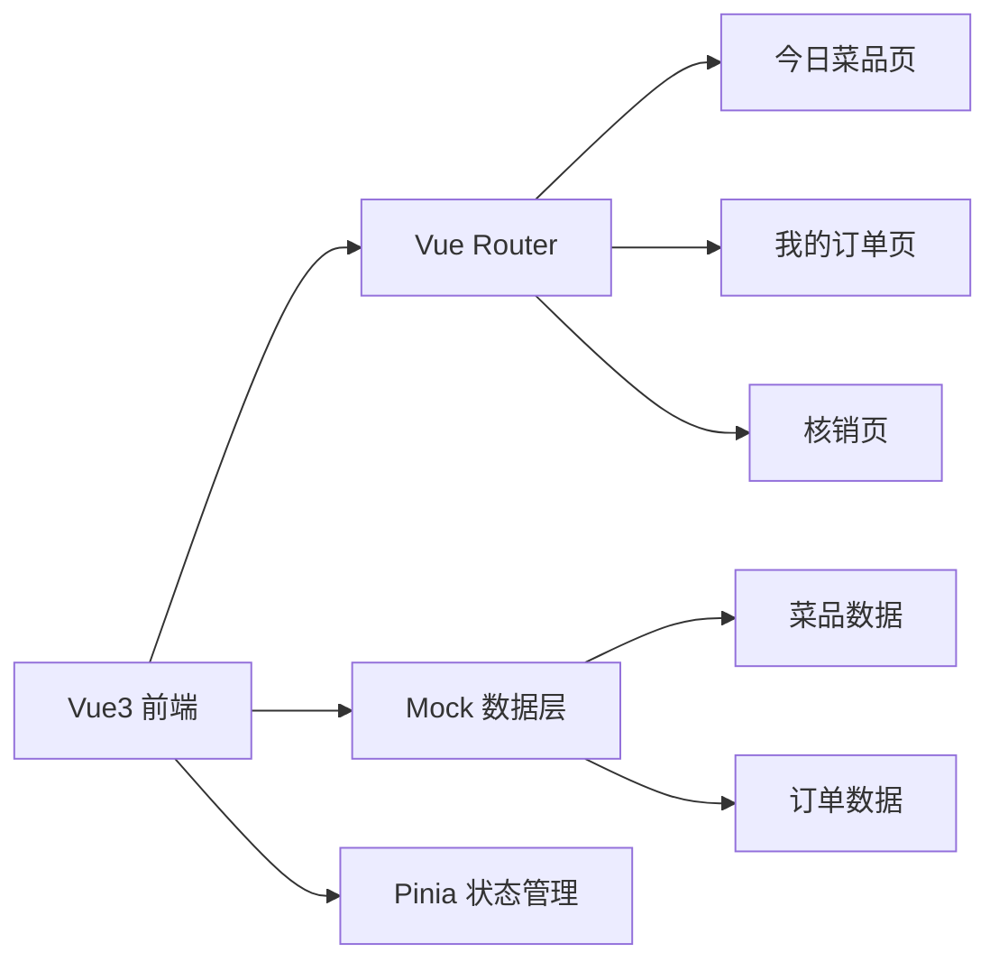
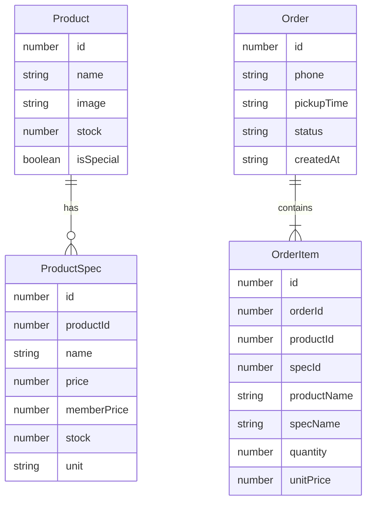

## 1. 架构设计

## 2. 技术说明

- 前端：Vue3 + TypeScript + Vite + Tailwind CSS
- 初始化工具：vite-init
- 后端：无，纯前端 Mock 数据
- 状态管理：使用 Vue3 reactive/composable 管理购物车和订单状态
- 路由：vue-router 4.x
- 图标：lucide-vue-next

## 3. 路由定义

| 路由 | 用途 |
|------|------|
| / | 今日菜品页，特惠横幅+菜品网格+购物底栏 |
| /orders | 我的订单页，待取/历史Tab切换 |
| /verify | 核销页，手机号查询+核销操作 |

## 4. 数据模型

### 4.1 数据模型定义

### 4.2 状态定义

- **购物车状态**：items（菜品规格+数量）、totalPrice、totalCount
- **订单状态**：orders 列表，含 pending/historical 分类
- **核销状态**：查询结果列表、核销操作反馈
